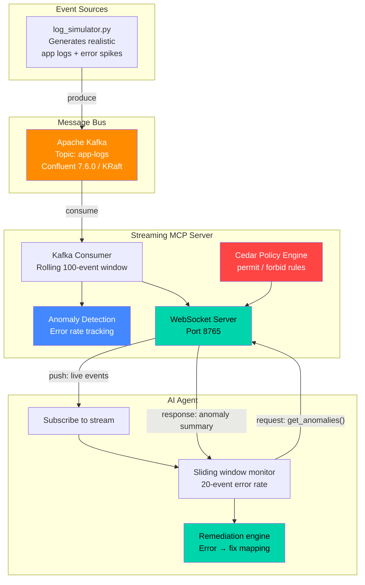

# MCP Live: Streaming Context to AI Agents

A working demo of **streaming MCP (Model Context Protocol)** — pushing real-time context to AI agents using Kafka, WebSockets, and Cedar authorization.

Instead of the traditional request/response MCP model where agents poll for stale snapshots, this demo shows agents receiving live events as they happen, detecting anomalies in under 1 second, and suggesting fixes automatically.

## Architecture



### Data Flow

```
log_simulator.py → Kafka (app-logs) → streaming_mcp_server.py → agent_client.py
                                              ↕ WebSocket
                                        subscribe / get_anomalies / get_context
```

## What You'll See

- Normal log traffic flowing through the agent in real-time
- Every ~30 seconds, an error spike hits
- The agent detects the spike, flags the anomaly, and suggests fixes
- The agent queries the server for anomaly summaries mid-stream (hybrid protocol)

## Prerequisites

| Tool | Version Tested | Purpose |
|------|---------------|---------|
| Python | 3.9+ | Runtime for all components |
| Docker | 29.3+ | Runs Kafka container |
| Apache Kafka | 7.6.0 (Confluent) | Durable event streaming bus |
| confluent-kafka (Python) | 2.13.2 | Kafka producer/consumer client |
| websockets (Python) | 15.0.1 | WebSocket server & client |
| python-pptx (Python) | 1.0.2 | Presentation slide generation |
| matplotlib (Python) | 3.9+ | Diagram generation for slides |
| Cedar | — | Authorization policy language (embedded) |

## Demo Setup (run in order)

### 1. Start Kafka
```bash
docker compose up -d
```
Wait ~15 seconds for Kafka to fully initialize (KRaft controller election + broker startup).

### 2. Install dependencies
```bash
pip install confluent-kafka websockets
```

### 3. Start the Streaming MCP Server
```bash
python streaming_mcp_server.py
```
You should see: `Streaming MCP Server running on ws://localhost:8765`

### 4. Start the Log Simulator (separate terminal)
```bash
python log_simulator.py
```
This produces realistic application logs to Kafka every second.

### 5. Start the AI Agent (separate terminal)
```bash
python agent_client.py
```
The agent subscribes to the live stream and begins monitoring.

### 5b. Interactive Agent (alternative)
```bash
python agent_client_interactive.py
```
Same as above, but you can type commands while events stream:
- `anomalies` — query the server for anomaly summary
- `context` — get current server context
- `status` — show local event count and error window
- `help` — list commands
- `quit` — exit

### Quick Start (tmux)
Run all components in one command:
```bash
tmux new-session -s mcp -d 'PYTHONUNBUFFERED=1 python3 streaming_mcp_server.py' \; \
  split-window -h 'sleep 2 && PYTHONUNBUFFERED=1 python3 log_simulator.py' \; \
  split-window -v 'sleep 4 && PYTHONUNBUFFERED=1 python3 agent_client_interactive.py' \; \
  attach
```

### Tip: Unbuffered Output
If output appears delayed, use `PYTHONUNBUFFERED=1`:
```bash
PYTHONUNBUFFERED=1 python agent_client.py
```

## Key Patterns Demonstrated

1. **Event subscription** — agent subscribes once, gets continuous updates via `subscribe` / `unsubscribe`
2. **Hybrid protocol** — streaming + request/response (`get_anomalies`, `get_context`) on same WebSocket
3. **Sliding window anomaly detection** — server tracks error rates in a rolling 100-event buffer; agent triggers at >30% error rate
4. **Automatic remediation** — agent maps error patterns (ConnectionRefused, OOM, Timeout, Deadlock, SSL, Disk) to fix suggestions
5. **Backpressure handling** — bounded 500-event queues per subscriber; slow consumers are dropped
6. **Cedar authorization** — declarative permit/forbid policies controlling which agents can subscribe to which streams
7. **Kafka as durable event bus** — replayable, decoupled, scalable; consumer groups for load balancing or fan-out

## Files

| File | Description |
|------|-------------|
| `streaming_mcp_server.py` | Core streaming MCP server — Kafka consumer + WebSocket push |
| `streaming_mcp_server_cedar.py` | Server variant with Cedar authorization |
| `agent_client.py` | AI agent — subscribes, detects anomalies, suggests fixes |
| `agent_client_interactive.py` | Interactive agent — same as above + accepts user commands mid-stream |
| `log_simulator.py` | Produces realistic log events to Kafka |
| `cedar_authz.py` | Cedar policy engine for MCP action authorization |
| `mock_kafka.py` | In-process mock Kafka for testing without Docker |
| `test_integration.py` | Integration tests |
| `docker-compose.yml` | Kafka (Confluent cp-kafka 7.6.0, KRaft mode) |
| `generate_slides.py` | Original presentation slide generator |
| `generate_slides_with_images.py` | Enhanced generator with diagrams + speaker notes |
| `MCP_Live_Streaming_Context.pptx` | Presentation with 12 slides, embedded diagrams, and detailed talking points |

## Presentation

The `MCP_Live_Streaming_Context.pptx` includes:
- 12 slides covering the problem, architecture, protocol, Cedar auth, demo, production patterns, and use cases
- Embedded matplotlib diagrams (architecture flow, sequence diagrams, anomaly charts, use case maps)
- Detailed speaker notes with talking points for each slide

To regenerate:
```bash
pip install python-pptx matplotlib
python generate_slides_with_images.py
```

## Teardown

```bash
# Stop Python processes
pkill -f "streaming_mcp_server.py"
pkill -f "log_simulator.py"
pkill -f "agent_client.py"

# Stop Kafka
docker compose down -v
```

## License

All open source: Apache Kafka, Cedar, WebSockets, Python.
